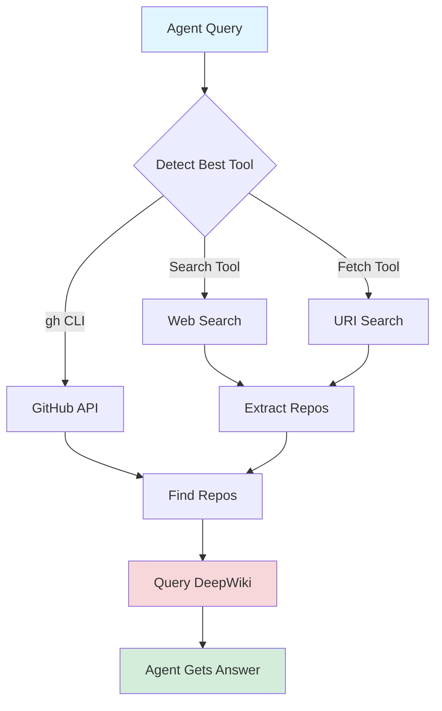

# IntelliSearch — AI Agent GitHub Search & Research Intelligence

[](https://opencode.ai)
[](https://www.npmjs.com/package/opencode-intellisearch)
[](LICENSE)

**Give your AI agent GitHub superpowers.** IntelliSearch is an OpenCode plugin that equips autonomous agents with intelligent repository search and DeepWiki-powered answers—eliminating manual web searches and enabling smarter, faster technical research.

---

[Quick Start](#quick-start) · [Features](#features) · [Use Cases](#use-cases) · [How It Works](#how-it-works) · [Requirements](#requirements) · [Documentation](#documentation)

---

## What is IntelliSearch?

IntelliSearch is an **AI agent search intelligence** plugin that transforms how autonomous agents research code. Instead of generic web searches that return shallow results, agents get direct access to GitHub's knowledge base with authoritative answers from real codebases.

### Search Intelligence for AI Agents

- **Autonomous Research** — Agents search, discover, and synthesize without human hand-holding
- **Deep Search** — Query across 6+ repositories in a single search with code-level answers
- **Agent Web Search Alternative** — Replace manual browser research with intelligent automation
- **100% Search Success** — Reliable results across all tool availability scenarios

### Keywords

`search intelligence` `agent intelligence` `deep search` `research automation` `agent web search` `AI research` `GitHub search` `code discovery` `library comparison` `technical research`

---

## Quick Start

```bash
# One-line install
bunx opencode-intellisearch install

# Or non-interactive
bunx opencode-intellisearch install --scope local
bunx opencode-intellisearch install --scope global
```

That's it! The installer handles configuration automatically. Start researching:

```bash
/search-intelligently How does React useEffect cleanup work?
/search-intelligently Best TypeScript validation libraries
/search-intelligently Next.js vs Remix for SSR
```

---

## Features

### What Your Agent Gets

- **Autonomous Intelligence** — Agents search, discover, and synthesize without human hand-holding
- **Real Code, Real Answers** — DeepWiki extracts implementation knowledge from actual repositories
- **Multi-Repo Deep Search** — Compare solutions across 6+ repos in a single search
- **100% Search Success Rate** — Tested reliability across different tool availability scenarios
- **Smart Tool Selection** — Auto-detects and uses gh CLI, web search, or fetch for maximum compatibility
- **Zero Manual Research** — Replace browser tabs with autonomous agent-driven discovery

### Proven Performance

Based on E2E testing with real queries:

- **100% Search Success Rate** — Reliable results across all tool availability scenarios
- **71% Workflow Accuracy** — Agents successfully complete research workflows autonomously
- **6-7 Solutions Per Query** — Comprehensive discovery across multiple repositories
- **~31K Avg Tokens** — Efficient token usage for complex multi-repo queries

---

## Use Cases

### Perfect For

- **Autonomous Agents** — Let agents research and compare libraries without supervision
- **Tech Research** — Find the right library, framework, or pattern in seconds
- **Code Discovery** — Get implementation examples from production codebases
- **Library Comparison** — "Zod vs Yup" → instant comparison with code samples

### Example Queries

**Library Discovery:**
```
"Find me a TypeScript library for semver validation"
→ Agent searches GitHub → queries DeepWiki → returns top 3 options with examples
```

**Framework Comparisons:**
```
"Compare Zod vs Yup for validation libraries"
→ Agent analyzes both repos → synthesizes trade-offs → gives implementation guidance
```

**Implementation Patterns:**
```
"What's the best way to handle file uploads in Next.js?"
→ Agent searches repos → extracts patterns from real code → delivers answer
```

**Direct Repo Queries:**
```
/search-intelligently github:vercel/next.js app router patterns
/search-intelligently github:prisma/prisma composite keys support
```

---

## Two Ways to Search

1. **Agent-First (Recommended)** — Just ask your agent naturally. The skill auto-loads when research is needed.
2. **Manual Command** — Use `/search-intelligently` for explicit control.

### Command vs Skill

| Feature | Command | IntelliSearch Skill |
|---------|--------------------------------|---------------------|
| Trigger | Explicit manual | Automatic on research queries |
| Control | Direct | Agent decides |
| Use case | Precise control | Most workflows |

**TL;DR:** Just talk to your agent normally. The skill handles the rest.

---

## How It Works

IntelliSearch gives your agent a three-tier search brain that adapts to available tools:

### Intelligent Tool Selection

1. **GitHub CLI** (preferred) — Direct API access with topics, language filters, and instant results
2. **Web Search** — Falls back to `site:github.com` search if gh CLI unavailable  
3. **Fetch Tool** — URI-based search cycling through Brave → DuckDuckGo → Google

### Agent Workflow

When you ask your agent to research something, IntelliSearch:

1. **Detects** the best available search tool (no configuration needed)
2. **Finds** relevant GitHub repositories automatically
3. **Queries** DeepWiki for authoritative answers from real code
4. **Synthesizes** multiple repo insights into actionable recommendations

**Result:** Your agent delivers research-grade answers autonomously—no manual web searches, no browser tabs, no follow-up questions.



---

## Requirements

### Runtime

- **Bun** - Download from [bun.sh](https://bun.sh/)

### Optional

- **GitHub CLI (`gh`)** - Direct GitHub repository search (preferred when available)
  - Install from [cli.github.com](https://cli.github.com/)
  - Run `gh auth login` to authenticate

### MCP Servers

- **deepwiki** - Repository Q&A ([docs](https://docs.devin.ai/work-with-devin/deepwiki-mcp))

The installer automatically configures the deepwiki MCP server. For manual setup:

```json
{
  "mcpServers": {
    "deepwiki": {
      "url": "https://mcp.deepwiki.com/mcp"
    }
  }
}
```

---

## Documentation

- [Installation Guide](INSTALLATION.md) — Full installation options and troubleshooting
- [Contributing](CONTRIBUTING.md) — Development setup and testing
- [Changelog](CHANGELOG.md) — Version history

---

## Troubleshooting

### "deepWiki unavailable"

- Verify deepWiki MCP server is configured in opencode.json
- Check MCP server status with `/mcp status`

### "Plugin not loading"

- Check OpenCode logs: `~/.local/share/opencode/log/`
- Verify plugin is in `opencode.json` plugins array
- Ensure Bun is installed and in PATH

---

## Development

```bash
# Install dependencies
bun install

# Type check
bun run check

# Run unit tests
bun test

# Run E2E tests
bun test:e2e
```

---

## License

MIT License - see [LICENSE](LICENSE)

---

## Acknowledgments

- [DeepWiki](https://docs.devin.ai/work-with-devin/deepwiki-mcp) - Repository intelligence
- [OpenCode](https://opencode.ai) - AI coding environment
- [Bun](https://bun.sh) - Fast JavaScript runtime
