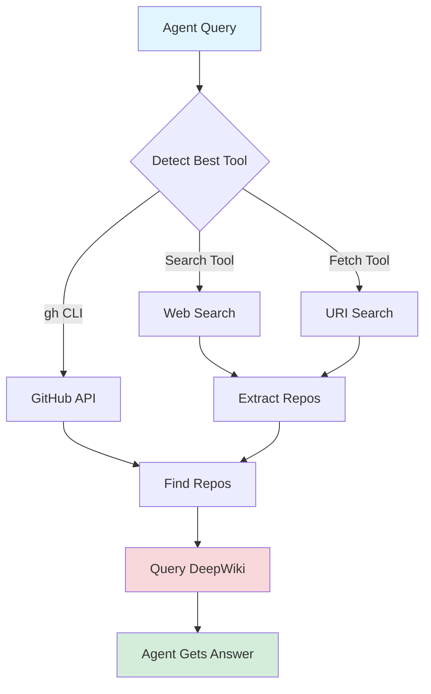

# IntelliSearch

**Give your AI agent GitHub superpowers.**

IntelliSearch is an OpenCode plugin that equips autonomous agents with intelligent repository search and DeepWiki-powered answers—eliminating manual web searches and enabling smarter, faster technical research.

## Why IntelliSearch?

**The Problem:** AI agents waste tokens and time on generic web searches, returning shallow answers that require follow-up queries and human intervention.

**The Solution:** IntelliSearch gives agents direct access to GitHub's knowledge base, delivering authoritative answers from real codebases in a single query.

### What Your Agent Gets

- **Autonomous Intelligence** — Agents search, discover, and synthesize without human hand-holding
- **Real Code, Real Answers** — DeepWiki extracts implementation knowledge from actual repositories
- **One Query, Multiple Repos** — Compare solutions across 6+ repos in a single search (E2E tested)
- **100% Search Success Rate** — Tested reliability across different tool availability scenarios
- **Smart Tool Selection** — Auto-detects and uses gh CLI, web search, or fetch for maximum compatibility
- **Zero Manual Research** — Replace browser tabs with autonomous agent-driven discovery

### Perfect For

- **Autonomous Agents** — Let agents research and compare libraries without supervision
- **Tech Research** — Find the right library, framework, or pattern in seconds
- **Code Discovery** — Get implementation examples from production codebases
- **Library Comparison** — "Zod vs Yup" → instant comparison with code samples

### Proven Performance

Based on E2E testing with real queries:

- **100% Search Success Rate** — Reliable results across all tool availability scenarios
- **71% Workflow Accuracy** — Agents successfully complete research workflows autonomously
- **6-7 Solutions Per Query** — Comprehensive discovery across multiple repositories
- **~31K Avg Tokens** — Efficient token usage for complex multi-repo queries

## Quick Start

**Power up your agent in 30 seconds:**

**One-line install:**

```bash
bun add -g opencode-intellisearch
```

Add to `~/.config/opencode/opencode.json`:

```json
{
  "$schema": "https://opencode.ai/config.json",
  "plugins": ["opencode-intellisearch"],
  "mcpServers": {
    "deepwiki": {
      "url": "https://mcp.deepwiki.com/mcp"
    }
  }
}
```

**Done.** Start searching:

```bash
/search-intelligently How does React useEffect cleanup work?
/search-intelligently Best TypeScript validation libraries
/search-intelligently Next.js vs Remix for SSR
```

## Installation

Add to your `opencode.json`:

```json
{
  "$schema": "https://opencode.ai/config.json",
  "plugins": ["opencode-intellisearch"]
}
```

Or install locally in your project:

```bash
bun add -d opencode-intellisearch
```

Then add to your project's `opencode.json`:

```json
{
  "plugins": ["opencode-intellisearch"]
}
```

## Usage

**Two ways to search:**

1. **Agent-First (Recommended)** — Just ask your agent naturally. The skill auto-loads when research is needed.
2. **Manual Command** — Use `/search-intelligently` for explicit control.

### Agent-Powered Research (Automatic)

Once installed, agents automatically use IntelliSearch for technical queries:

### Agent-Powered Research

**Library Discovery:**
```bash
"Find me a TypeScript library for semver validation"
# Agent searches GitHub → queries DeepWiki → returns top 3 options with examples
```

**Framework Comparisons:**
```bash
"Compare Zod vs Yup for validation libraries"
# Agent analyzes both repos → synthesizes trade-offs → gives implementation guidance
```

**Implementation Patterns:**
```bash
"What's the best way to handle file uploads in Next.js?"
# Agent searches repos → extracts patterns from real code → delivers answer
```

**Direct Repo Queries:**
```bash
/search-intelligently github:vercel/next.js app router patterns
/search-intelligently github:prisma/prisma composite keys support
```

### How Agents Use It

1. **Autonomous Activation** — Agent detects research query → loads skill automatically
2. **Smart Search** — Selects best tool, finds repos, filters by relevance
3. **Deep Analysis** — Queries DeepWiki for authoritative answers
4. **Synthesis** — Returns comprehensive answer with code examples

### Command vs Skill: What's the Difference?

**`/search-intelligently` Command** (Human-controlled)
- Explicit manual trigger
- Direct control over search parameters
- Use when you want precise control

**IntelliSearch Skill** (Agent-controlled)
- Auto-loads when agent needs research capabilities
- Triggers on natural language queries
- Agent decides when to search autonomously
- Preferred for most workflows

**TL;DR:** Just talk to your agent normally. The skill handles the rest.

## Requirements

### Runtime

- **Bun** - Download from [bun.sh](https://bun.sh/)

### Optional

- **GitHub CLI (`gh`)** - Direct GitHub repository search (preferred when available)
  - Install from [cli.github.com](https://cli.github.com/)
  - Run `gh auth login` to authenticate

### MCP Servers

**Required:**
- **deepwiki** - Repository Q&A ([docs](https://docs.devin.ai/work-with-devin/deepwiki-mcp))

Configure in `~/.config/opencode/opencode.json` or project `opencode.json`:

```json
{
  "$schema": "https://opencode.ai/config.json",
  "mcpServers": {
    "deepwiki": {
      "url": "https://mcp.deepwiki.com/mcp"
    }
  }
}
```

## How It Works

IntelliSearch gives your agent a three-tier search brain that adapts to available tools:

### Intelligent Tool Selection

1. **GitHub CLI** (preferred) — Direct API access with topics, language filters, and instant results
2. **Web Search** — Falls back to `site:github.com` search if gh CLI unavailable  
3. **Fetch Tool** — URI-based search cycling through Brave → DuckDuckGo → Google

### Agent-First Design

When you ask your agent to research something, IntelliSearch:

1. **Detects** the best available search tool (no configuration needed)
2. **Finds** relevant GitHub repositories automatically
3. **Queries** DeepWiki for authoritative answers from real code
4. **Synthesizes** multiple repo insights into actionable recommendations

**Result:** Your agent delivers research-grade answers autonomously—no manual web searches, no browser tabs, no follow-up questions.



## Documentation

- [Installation](INSTALLATION.md)
- [Contributing](CONTRIBUTING.md)
- [Changelog](CHANGELOG.md)

## Troubleshooting

### "deepWiki unavailable"

- Verify deepWiki MCP server is configured in opencode.json
- Check MCP server status with `/mcp status`

### "Plugin not loading"

- Check OpenCode logs: `~/.local/share/opencode/log/`
- Verify plugin is in `opencode.json` plugins array
- Ensure Bun is installed and in PATH

## Development

```bash
# Install dependencies
bun install

# Type check
bun run check

# Run unit tests
bun test

# Run E2E tests
bun test:e2e

# Link for local testing
bun link && bun link opencode-intellisearch --cwd ~/.cache/opencode/node_modules/
```

See [CONTRIBUTING.md](CONTRIBUTING.md) for detailed development instructions.

## License

MIT License - see [LICENSE](LICENSE)

## Acknowledgments

- [DeepWiki](https://docs.devin.ai/work-with-devin/deepwiki-mcp) - Repository intelligence
- [OpenCode](https://opencode.ai) - AI coding environment
- [Bun](https://bun.sh) - Fast JavaScript runtime
