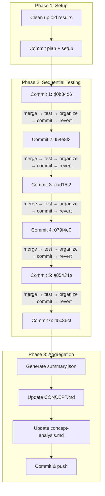

# E2E Commit Matrix Testing Plan

## Overview

This document outlines the plan for running automated E2E tests against each commit in the `multiple-search-providers` branch to measure the progression of token efficiency and search quality across algorithm changes.

## Branches

| Branch                        | Purpose                           |
| ----------------------------- | --------------------------------- |
| `main`                        | Production branch                 |
| `multiple-search-providers`   | Branch-under-test (contains commits to test) |
| `test-multiple-search-providers` | Testing branch (contains e2e code + results) |

## Test Configuration

| Parameter       | Value                                                        |
| --------------- | ------------------------------------------------------------ |
| Runs per commit | 2                                                            |
| Model           | `minimax/MiniMax-M2.5`                                       |
| Query file      | `tests/e2e/test-queries/graph-db-search.md`                  |
| Poll interval   | 20 seconds                                                   |
| Cleanup         | Full revert after each test (staged + working + untracked)   |
| Preserve results| Do NOT clean `tests/e2e/results/` before starting            |

## Commits Under Test (Chronological Order)

| # | Commit  | Directory Name                     | Message                                      | Files Changed               |
|---|---------|----------------------------------- | --------------------------------------------- | --------------------------- |
| 1 | d0b34d6 | `d0b34d6-refactor-search-workflow` | refactor(search-workflow): optimize for LLM   | search-workflow.md          |
| 2 | f54e8f3 | `f54e8f3-gh-cli-provider`          | feat(search): add GitHub CLI provider         | SKILL.md, gh-cli.md         |
| 3 | cad15f2 | `cad15f2-skill-refinements`        | Analysis + skill refinements                  | SKILL.md, search-workflow.md|
| 4 | 079f4e0 | `079f4e0-token-budget-rules`       | feat(skill): add token budget rules           | SKILL.md                    |
| 5 | a85434b | `a85434b-filter-step-workflow`     | feat(skill): add filter step to workflow      | SKILL.md                    |
| 6 | 45c36cf | `45c36cf-deepwiki-efficiency`      | feat(skill): add DeepWiki efficiency rules    | SKILL.md                    |

### Skipped Commits

| Commit  | Reason       |
| ------- | ------------ |
| 6b82434 | Docs only    |
| fe2d146 | Docs only    |
| 680db5b | Merge commit |

## Execution Workflow

### Phase 1: Setup

1. Clean up existing test results in `tests/e2e/results/`
2. Commit plan document and test runner changes

### Phase 2: Sequential Commit Testing

For each commit (executed by agent using background processes):

```
LOOP FOR EACH COMMIT:

  1. Track baseline state:
     git diff --name-only > /tmp/pre-merge-files.txt

  2. Merge commit changes without committing:
     git merge --no-commit --no-ff <commit-hash>
     git restore --staged .

  3. Track merged files for debugging:
     git diff --name-only > /tmp/post-merge-files.txt

  4. Run E2E tests in background:
      bun run test:e2e (background process)

  5. Poll for completion every 20 seconds:
      - Check for new results directory
      - Monitor background process output

  6. Once complete, organize results:
      - Create metadata.json
      - Move results to tests/e2e/results/commits/<hash-slug>/

  7. Commit results:
      git add tests/e2e/results/commits/<hash-slug>/
      git commit -m "test(e2e): results for <hash>"

  8. FULL REVERT of all merged changes:
      git restore --staged .          # Unstage everything
      git restore .                    # Discard working tree changes
      git clean -fd                    # Remove untracked files/dirs from merge
      git merge --abort 2>/dev/null || true  # Abort any pending merge

  9. Verify clean state:
      git status --short should be empty
      Log progress to tests/e2e/results/progress.log

  REPEAT for next commit
```

### Phase 3: Aggregation

1. Generate `tests/e2e/results/summary.json`
2. Update `docs/CONCEPT.md` with comparison table
3. Update `docs/concept-analysis.md` with progression analysis
4. Commit documentation updates
5. Push test branch

## Directory Structure

```
tests/e2e/results/
├── commits/
│   ├── d0b34d6-refactor-search-workflow/
│   │   ├── metadata.json           # Commit info, model, timestamp
│   │   ├── token-metrics.json      # Token usage summary
│   │   └── consistency-report.json # Solution overlap analysis
│   ├── f54e8f3-gh-cli-provider/
│   │   └── ...
│   └── ... (6 total)
├── progress.log                    # Test execution progress
├── failures.log                    # Failed test runs
└── summary.json                    # Aggregated comparison
```

## Metadata Schema

```json
{
  "commit": "d0b34d6",
  "fullHash": "d0b34d6...",
  "message": "refactor(search-workflow): optimize for LLM consumption",
  "timestamp": "2026-02-28T...",
  "runs": 2,
  "model": "minimax/MiniMax-M2.5",
  "testDate": "2026-03-01T..."
}
```

## Success Criteria

1. All 6 commits tested successfully
2. Token metrics collected for each commit
3. Consistency reports generated
4. Documentation updated with progression analysis

## Failure Handling

If a test run fails:
1. Wait 30 seconds
2. Retry once
3. If still fails:
   - Log to `tests/e2e/results/failures.log`
   - **Full revert** (git restore --staged . && git restore . && git clean -fd)
   - Continue to next commit

## Workflow Diagram



## Current Status

**Testing Complete** - All 6 commits tested successfully on 2026-03-02

| Commit  | Status    | Avg Tokens | Jaccard | Unique Solutions | Notes |
| ------- | --------- | ---------- | ------- | ---------------- | ----- |
| d0b34d6 | ✓ Complete| 79,539     | 0.24    | 85               | Baseline - decreasing token trend |
| f54e8f3 | ✓ Complete| 67,518     | 0.24    | 85               | GH CLI added - increasing token trend |
| cad15f2 | ✓ Complete| 63,385     | 0.35    | 59               | Skill refinements - improved consistency |
| 079f4e0 | ✓ Complete| 62,308     | **0.60**| 68               | **Best consistency** - token budget rules |
| a85434b | ✓ Complete| 64,187     | 0.30    | 67               | Filter step - consistency dropped |
| 45c36cf | ✓ Complete| **60,750** | 0.45    | **56**           | **Best efficiency** - DeepWiki rules |

**Summary:**
- Token reduction: 23.6% (79,539 → 60,750)
- Consistency improvement: 150% (0.24 → 0.45 avg)
- Best commit for consistency: 079f4e0 (Jaccard: 0.60)
- Best commit for efficiency: 45c36cf (Tokens: 60,750)
- Search success rate: 0% (auth/captcha issues across all tests)
