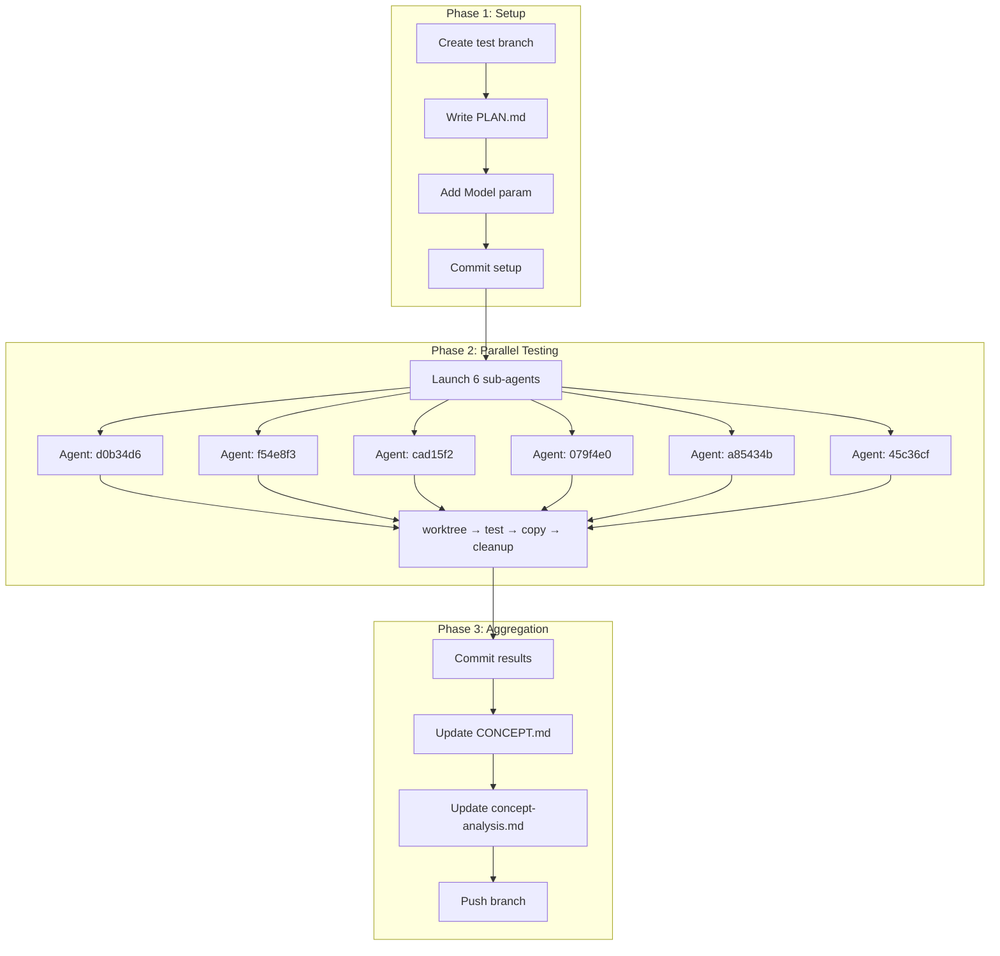

# E2E Commit Matrix Testing Plan

## Overview

This document outlines the plan for running automated E2E tests against each commit in the `multiple-search-providers` branch to measure the progression of token efficiency and search quality across algorithm changes.

## Branches

| Branch                        | Purpose                           |
| ----------------------------- | --------------------------------- |
| `main`                        | Production branch                 |
| `multiple-search-providers`   | Branch-under-test (contains commits to test) |
| `test-multiple-search-providers` | Testing branch (contains results) |

## Test Configuration

| Parameter    | Value                   |
| ------------ | ----------------------- |
| Runs per commit | 2                    |
| Model        | `minimax/MiniMax-M2.5`  |
| Query file   | `tests/e2e/test-queries/graph-db-search.md` |

## Commits Under Test

| # | Commit  | Directory Name                    | Message                                      | Files Changed               |
|---|---------|----------------------------------- | --------------------------------------------- | --------------------------- |
| 1 | d0b34d6 | `d0b34d6-refactor-search-workflow` | refactor(search-workflow): optimize for LLM   | search-workflow.md          |
| 2 | f54e8f3 | `f54e8f3-gh-cli-provider`          | feat(search): add GitHub CLI provider         | SKILL.md, gh-cli.md         |
| 3 | cad15f2 | `cad15f2-skill-refinements`        | Analysis + skill refinements                  | SKILL.md, search-workflow.md|
| 4 | 079f4e0 | `079f4e0-token-budget-rules`       | feat(skill): add token budget rules           | SKILL.md                    |
| 5 | a85434b | `a85434b-filter-step-workflow`     | feat(skill): add filter step to workflow      | SKILL.md                    |
| 6 | 45c36cf | `45c36cf-deepwiki-efficiency`      | feat(skill): add DeepWiki efficiency rules    | SKILL.md                    |

### Skipped Commits

| Commit  | Reason          |
| ------- | --------------- |
| 6b82434 | Docs only       |
| fe2d146 | Docs only       |
| 680db5b | Merge commit    |

## Execution Phases

### Phase 1: Setup

1. Create `test-multiple-search-providers` branch from main
2. Write this PLAN.md document
3. Modify `run-isolated-test.ps1` to accept `Model` parameter
4. Commit setup changes

### Phase 2: Parallel Testing

Each commit is tested by a dedicated sub-agent:

```
Sub-Agent Workflow:
1. Create temporary worktree
2. Checkout commit-under-test
3. Run E2E tests (2 runs with MiniMax-M2.5)
4. Create metadata.json
5. Copy results to main worktree
6. Delete temporary worktree
```

### Phase 3: Aggregation

1. Commit all test results
2. Update CONCEPT.md with comparison table
3. Update concept-analysis.md with progression analysis
4. Push test branch

## Directory Structure

```
tests/e2e/results/
├── commits/
│   ├── d0b34d6-refactor-search-workflow/
│   │   ├── metadata.json           # Commit info, model, timestamp
│   │   ├── token-metrics.json      # Token usage summary
│   │   └── consistency-report.json # Solution overlap analysis
│   ├── f54e8f3-gh-cli-provider/
│   │   └── ...
│   └── ... (6 total)
└── summary.json                    # Aggregated comparison
```

## Metadata Schema

```json
{
  "commit": "d0b34d6",
  "fullHash": "d0b34d6...",
  "message": "refactor(search-workflow): optimize for LLM consumption",
  "timestamp": "2026-02-28T...",
  "runs": 2,
  "model": "minimax/MiniMax-M2.5",
  "testDate": "2026-03-01T..."
}
```

## Success Criteria

1. All 6 commits tested successfully
2. Token metrics collected for each commit
3. Consistency reports generated
4. Documentation updated with progression analysis

## Failure Handling

If a sub-agent fails:
1. Wait 30 seconds
2. Launch new attempt
3. Log failure in `tests/e2e/results/failures.log`

## Workflow Diagram


